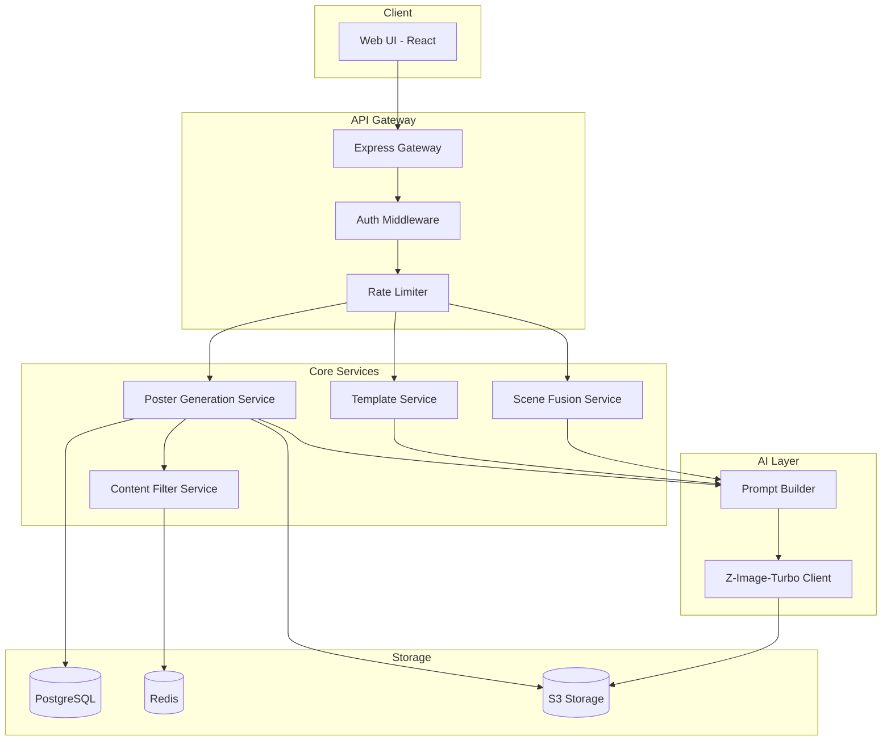

# Design Document: PopGraph 爆款图

## Overview

PopGraph 是一个基于 Z-Image-Turbo 模型的图文一体化 AI 生成 SaaS 平台。系统采用前后端分离架构，前端提供用户交互界面，后端负责请求处理、模型调用和图像生成。核心技术优势在于利用 Z-Image-Turbo 的中英双语文本渲染能力和亚秒级推理速度。

### 技术栈选择

- **前端**: React + TypeScript + TailwindCSS
- **后端**: Python + FastAPI
- **AI 模型**: Z-Image-Turbo (本地推理或 API)
- **图像处理**: Pillow, OpenCV
- **数据库**: PostgreSQL (用户/订单) + Redis (缓存/限流)
- **存储**: S3 兼容对象存储 (生成图像)
- **测试**: 
  - 前端: Vitest + fast-check
  - 后端: pytest + hypothesis (属性测试)

## Architecture



## Components and Interfaces

### 1. Poster Generation Service

负责核心的文生海报功能。

```python
from pydantic import BaseModel
from typing import Literal, Optional
from datetime import datetime

class PosterGenerationRequest(BaseModel):
    scene_description: str          # 画面描述
    marketing_text: str             # 指定文案
    language: Literal['zh', 'en']   # 语言
    template_id: Optional[str] = None  # 可选模板ID
    aspect_ratio: Literal['1:1', '9:16', '16:9']  # 输出尺寸
    batch_size: Literal[1, 4] = 1   # 生成数量

class GeneratedImage(BaseModel):
    id: str
    url: str
    thumbnail_url: str
    has_watermark: bool
    width: int
    height: int

class PosterGenerationResponse(BaseModel):
    request_id: str
    images: list[GeneratedImage]
    processing_time_ms: int
```

### 2. Template Service

管理预设商业模板。

```python
class PromptModifiers(BaseModel):
    style_keywords: list[str]       # 风格关键词
    color_scheme: str               # 配色方案
    layout_hints: str               # 排版提示
    font_style: str                 # 字体风格

class Template(BaseModel):
    id: str
    name: str
    category: Literal['promotional', 'premium', 'holiday']
    holiday_type: Optional[Literal['spring_festival', 'valentines', 'double_eleven']] = None
    prompt_modifiers: PromptModifiers
    preview_url: str

class TemplateService:
    async def list_templates(self, category: Optional[str] = None) -> list[Template]: ...
    async def get_template(self, template_id: str) -> Optional[Template]: ...
    async def apply_template(self, template_id: str, user_input: PosterGenerationRequest) -> str: ...
```

### 3. Scene Fusion Service

处理商品图场景融合。

```python
class SceneFusionRequest(BaseModel):
    product_image_url: str          # 商品白底图URL
    target_scene: str               # 目标场景描述
    aspect_ratio: Literal['1:1', '9:16', '16:9']

class SceneFusionResponse(BaseModel):
    request_id: str
    fused_image_url: str
    processing_time_ms: int

class ExtractedProduct(BaseModel):
    image_data: bytes
    mask: bytes
    bounding_box: tuple[int, int, int, int]

class SceneFusionService:
    async def extract_product(self, image_url: str) -> ExtractedProduct: ...
    async def fuse_with_scene(self, product: ExtractedProduct, scene: str) -> SceneFusionResponse: ...
```

### 4. Content Filter Service

敏感内容过滤。

```python
class ContentFilterResult(BaseModel):
    is_allowed: bool
    blocked_keywords: list[str]
    warning_message: Optional[str] = None

class ContentFilterService:
    async def check_content(self, text: str) -> ContentFilterResult: ...
    async def add_to_blocklist(self, keywords: list[str]) -> None: ...
```

### 5. Prompt Builder

构建发送给 Z-Image-Turbo 的 Prompt。

```python
class PromptBuilder:
    def build_poster_prompt(
        self, 
        request: PosterGenerationRequest, 
        modifiers: Optional[PromptModifiers] = None
    ) -> str: ...
    
    def build_scene_fusion_prompt(self, scene: str, product_description: str) -> str: ...
    
    def inject_text_placement(
        self, 
        base_prompt: str, 
        text: str, 
        language: Literal['zh', 'en']
    ) -> str: ...
```

### 6. Z-Image-Turbo Client

与 AI 模型交互的客户端。

```python
class GenerationOptions(BaseModel):
    width: int
    height: int
    seed: Optional[int] = None
    guidance_scale: Optional[float] = None

class GeneratedImageData(BaseModel):
    image_buffer: bytes
    generation_time_ms: int
    model_version: str

class ZImageTurboClient:
    async def generate_image(
        self, 
        prompt: str, 
        options: GenerationOptions
    ) -> GeneratedImageData: ...
    
    async def generate_batch(
        self, 
        prompt: str, 
        count: int, 
        options: GenerationOptions
    ) -> list[GeneratedImageData]: ...
    
    async def image_to_image(
        self, 
        source_image: bytes, 
        prompt: str, 
        options: GenerationOptions
    ) -> GeneratedImageData: ...
```

### 7. Rate Limiter

基于用户会员等级的限流。

```python
from enum import Enum

class MembershipTier(str, Enum):
    FREE = 'free'
    BASIC = 'basic'
    PROFESSIONAL = 'professional'

RATE_LIMIT_CONFIG = {
    MembershipTier.FREE: {'daily_limit': 5, 'priority': 'low'},
    MembershipTier.BASIC: {'daily_limit': 100, 'priority': 'normal'},
    MembershipTier.PROFESSIONAL: {'daily_limit': -1, 'priority': 'high'},  # -1 表示无限
}

class RateLimitResult(BaseModel):
    allowed: bool
    remaining_quota: int
    reset_time: Optional[datetime] = None

class RateLimiter:
    async def check_limit(self, user_id: str, tier: MembershipTier) -> RateLimitResult: ...
    async def increment_usage(self, user_id: str) -> None: ...
    async def get_remaining_quota(self, user_id: str) -> int: ...
```

## Data Models

### User Model

```python
from sqlalchemy import Column, String, Enum, DateTime, Integer, Date
from sqlalchemy.ext.declarative import declarative_base

Base = declarative_base()

class User(Base):
    __tablename__ = 'users'
    
    id: str = Column(String, primary_key=True)
    email: str = Column(String, unique=True, nullable=False)
    membership_tier: MembershipTier = Column(Enum(MembershipTier), default=MembershipTier.FREE)
    membership_expiry: Optional[datetime] = Column(DateTime, nullable=True)
    daily_usage_count: int = Column(Integer, default=0)
    last_usage_date: date = Column(Date, nullable=False)
    created_at: datetime = Column(DateTime, nullable=False)
    updated_at: datetime = Column(DateTime, nullable=False)
```

### Generation Record Model

```python
class GenerationRecord(Base):
    __tablename__ = 'generation_records'
    
    id: str = Column(String, primary_key=True)
    user_id: str = Column(String, ForeignKey('users.id'), nullable=False)
    type: str = Column(Enum('poster', 'scene_fusion'), nullable=False)
    input_params: dict = Column(JSON, nullable=False)
    output_urls: list[str] = Column(JSON, nullable=False)
    processing_time_ms: int = Column(Integer, nullable=False)
    has_watermark: bool = Column(Boolean, nullable=False)
    created_at: datetime = Column(DateTime, nullable=False)
```

### Template Model

```python
class TemplateRecord(Base):
    __tablename__ = 'templates'
    
    id: str = Column(String, primary_key=True)
    name: str = Column(String, nullable=False)
    category: str = Column(Enum('promotional', 'premium', 'holiday'), nullable=False)
    holiday_type: Optional[str] = Column(String, nullable=True)
    prompt_modifiers: dict = Column(JSON, nullable=False)
    preview_url: str = Column(String, nullable=False)
    is_active: bool = Column(Boolean, default=True)
    created_at: datetime = Column(DateTime, nullable=False)
    updated_at: datetime = Column(DateTime, nullable=False)
```


## Correctness Properties

*A property is a characteristic or behavior that should hold true across all valid executions of a system-essentially, a formal statement about what the system should do. Properties serve as the bridge between human-readable specifications and machine-verifiable correctness guarantees.*

基于需求文档的验收标准分析，以下是系统必须满足的正确性属性：

### Property 1: 文本渲染正确性

*For any* valid poster generation request with marketing text (Chinese or English), the generated prompt SHALL contain the exact user-provided text without modification, ensuring the text can be rendered correctly by the AI model.

**Validates: Requirements 1.1, 1.2**

### Property 2: 响应时间约束

*For any* single poster generation request on standard hardware, the total processing time from request receipt to response delivery SHALL be less than or equal to 5000 milliseconds.

**Validates: Requirements 2.1**

### Property 3: 批量生成数量一致性

*For any* poster generation request with preview mode enabled (batchSize = 4), the response SHALL contain exactly 4 generated images.

**Validates: Requirements 2.2**

### Property 4: 模板参数应用正确性

*For any* template application request, the generated prompt SHALL contain all style keywords, color scheme, layout hints, and font style parameters defined in the selected template configuration.

**Validates: Requirements 3.1, 3.2, 3.3**

### Property 5: 模板与用户输入组合完整性

*For any* poster generation request with a template, the final prompt SHALL contain both the template's prompt modifiers AND the user-provided scene description and marketing text.

**Validates: Requirements 3.4**

### Property 6: 输出尺寸正确性

*For any* poster generation request with a specified aspect ratio, the generated image dimensions SHALL match the requested ratio:
- 1:1 → width equals height
- 9:16 → width/height equals 9/16 (±1px tolerance)
- 16:9 → width/height equals 16/9 (±1px tolerance)

**Validates: Requirements 5.1, 5.2, 5.3**

### Property 7: 敏感词过滤有效性

*For any* user input containing keywords from the blocklist, the content filter SHALL return isAllowed = false and include the matched keywords in blockedKeywords array.

**Validates: Requirements 6.1**

### Property 8: 会员等级水印规则

*For any* poster generation request, the hasWatermark flag in the response SHALL be:
- true if user.membershipTier equals 'free'
- false if user.membershipTier equals 'basic' or 'professional'

**Validates: Requirements 7.1, 7.3**

### Property 9: 免费用户每日限额

*For any* free-tier user, after dailyUsageCount reaches 5, subsequent generation requests on the same day SHALL be rejected with allowed = false.

**Validates: Requirements 7.2**

### Property 10: 专业会员功能权限

*For any* scene fusion request, access SHALL be granted if and only if user.membershipTier equals 'professional'.

**Validates: Requirements 7.4**

## Error Handling

### 错误类型定义

```typescript
enum ErrorCode {
  // 输入验证错误 (4xx)
  INVALID_INPUT = 'INVALID_INPUT',
  CONTENT_BLOCKED = 'CONTENT_BLOCKED',
  RATE_LIMIT_EXCEEDED = 'RATE_LIMIT_EXCEEDED',
  FEATURE_NOT_AVAILABLE = 'FEATURE_NOT_AVAILABLE',
  INVALID_IMAGE_FORMAT = 'INVALID_IMAGE_FORMAT',
  
  // 系统错误 (5xx)
  AI_MODEL_ERROR = 'AI_MODEL_ERROR',
  STORAGE_ERROR = 'STORAGE_ERROR',
  INTERNAL_ERROR = 'INTERNAL_ERROR',
  TIMEOUT_ERROR = 'TIMEOUT_ERROR',
}

interface ApiError {
  code: ErrorCode;
  message: string;
  details?: Record<string, unknown>;
}
```

### 错误处理策略

| 错误场景 | 错误码 | 处理方式 |
|---------|--------|---------|
| 输入文本包含敏感词 | CONTENT_BLOCKED | 返回警告消息，列出被阻止的关键词 |
| 免费用户超出每日限额 | RATE_LIMIT_EXCEEDED | 返回剩余配额和重置时间 |
| 非专业会员访问场景融合 | FEATURE_NOT_AVAILABLE | 提示升级会员 |
| 上传图片格式不支持 | INVALID_IMAGE_FORMAT | 列出支持的格式 |
| AI 模型调用失败 | AI_MODEL_ERROR | 自动重试最多 3 次，失败后返回错误 |
| 生成超时 | TIMEOUT_ERROR | 返回部分结果或建议重试 |

## Testing Strategy

### 测试框架选择

**后端 (Python):**
- **单元测试**: pytest
- **属性测试**: hypothesis (Python 属性测试库)
- **集成测试**: pytest + httpx (异步 HTTP 客户端)

**前端 (TypeScript):**
- **单元测试**: Vitest
- **属性测试**: fast-check

### 单元测试覆盖

单元测试用于验证特定示例和边界情况：

1. **Prompt Builder 测试**
   - 验证中文文本正确嵌入 prompt
   - 验证英文文本正确嵌入 prompt
   - 验证特殊字符处理

2. **Template Service 测试**
   - 验证各类模板加载正确
   - 验证模板参数合并逻辑

3. **Content Filter 测试**
   - 验证已知敏感词被正确过滤
   - 验证正常内容通过过滤

4. **Rate Limiter 测试**
   - 验证限额边界条件 (第5次允许，第6次拒绝)
   - 验证跨日重置逻辑

### 属性测试覆盖

属性测试用于验证在所有有效输入上都成立的通用属性。每个属性测试必须：
- 运行至少 100 次迭代 (`@settings(max_examples=100)`)
- 使用注释标记对应的设计文档属性
- 格式: `**Feature: popgraph, Property {number}: {property_text}**`

**属性测试清单：**

1. **Property 1 测试**: 文本渲染正确性
   - 生成随机中英文文本，验证 prompt 包含原始文本

2. **Property 3 测试**: 批量生成数量一致性
   - 生成随机请求参数，验证 batch_size=4 时返回 4 张图

3. **Property 4 测试**: 模板参数应用正确性
   - 生成随机模板配置，验证所有参数出现在最终 prompt

4. **Property 5 测试**: 模板与用户输入组合完整性
   - 生成随机模板和用户输入，验证两者都出现在最终 prompt

5. **Property 6 测试**: 输出尺寸正确性
   - 生成随机尺寸请求，验证输出尺寸符合比例

6. **Property 7 测试**: 敏感词过滤有效性
   - 生成包含随机敏感词的输入，验证过滤结果正确

7. **Property 8 测试**: 会员等级水印规则
   - 生成随机会员等级，验证水印标记符合规则

8. **Property 9 测试**: 免费用户每日限额
   - 模拟随机使用次数，验证限额逻辑正确

9. **Property 10 测试**: 专业会员功能权限
   - 生成随机会员等级，验证场景融合权限正确

### 测试目录结构

```
backend/
├── app/
│   ├── services/
│   │   ├── poster_service.py
│   │   ├── template_service.py
│   │   ├── content_filter.py
│   │   └── scene_fusion_service.py
│   ├── utils/
│   │   ├── prompt_builder.py
│   │   └── rate_limiter.py
│   └── models/
│       └── schemas.py
├── tests/
│   ├── unit/
│   │   ├── test_prompt_builder.py
│   │   ├── test_template_service.py
│   │   ├── test_content_filter.py
│   │   └── test_rate_limiter.py
│   ├── property/
│   │   ├── test_prompt_builder_props.py
│   │   ├── test_content_filter_props.py
│   │   ├── test_rate_limiter_props.py
│   │   └── test_membership_props.py
│   └── integration/
│       └── test_api.py
└── conftest.py

frontend/
├── src/
│   ├── components/
│   ├── services/
│   └── utils/
└── tests/
    ├── unit/
    └── property/
```
